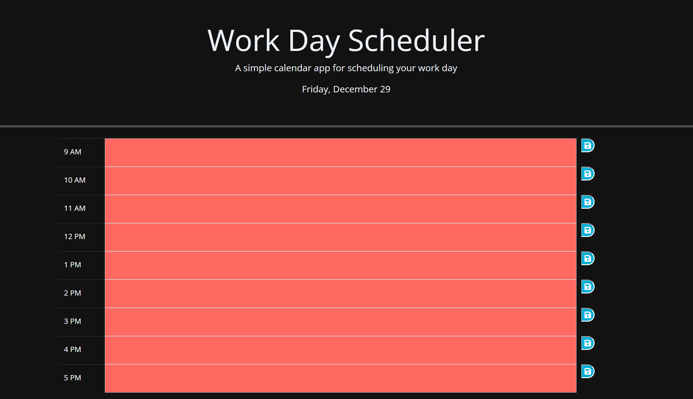

# Work Day Scheduler

## Description

In this project we created a workday scheduler. The styling was done with CSS and the functionality was coded with JavaScript. This challenge allowed us to become more familiar with JQuery and JavaScript. I learned how JQuery can be used to not only simplify our JS code, but also be used to add the currrent date to the browser.

## Repository

Link to deployed code: https://wintino5.github.io/Scheduler_M5WJr/

## Technologies

- Written with JavaScript HTML5 and CSS
- Follows SEO semantic structure

## License

MIT License

## Mock-Up

The following image shows the web application's functionality and appearance:

